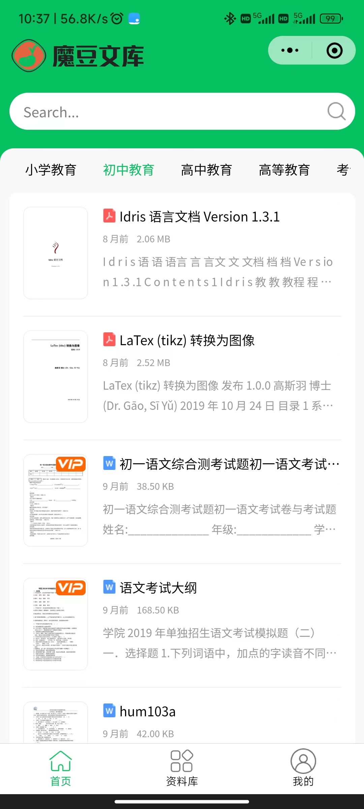
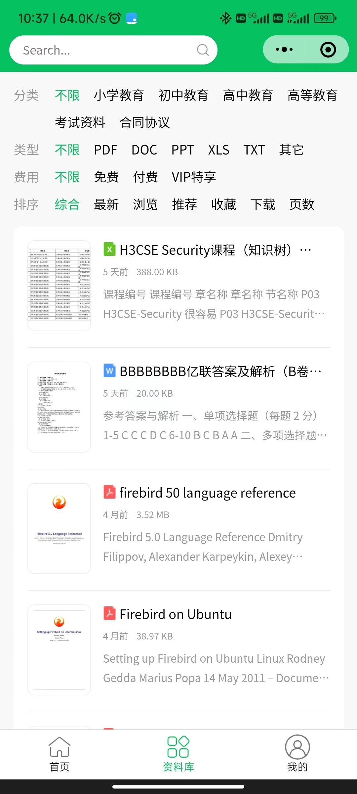
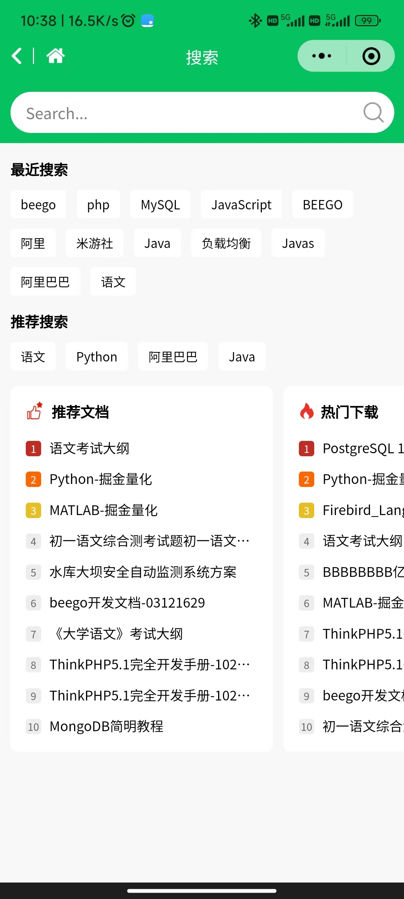
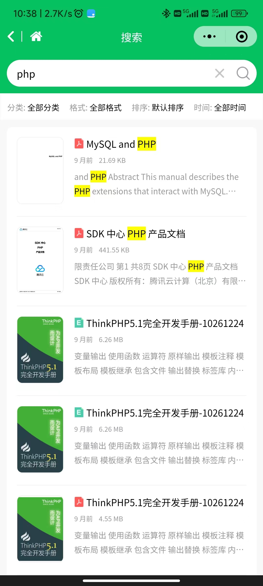
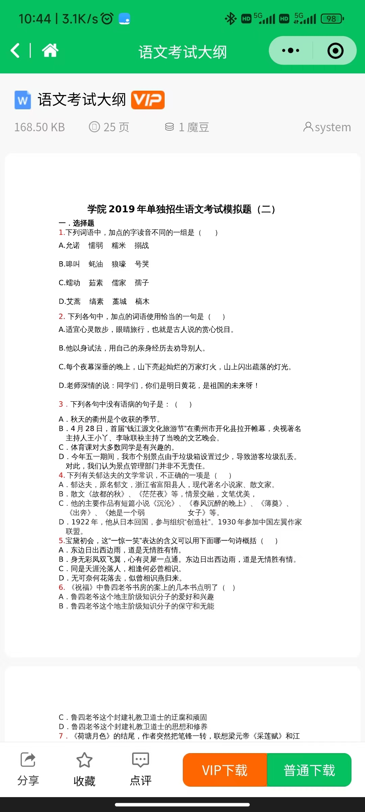
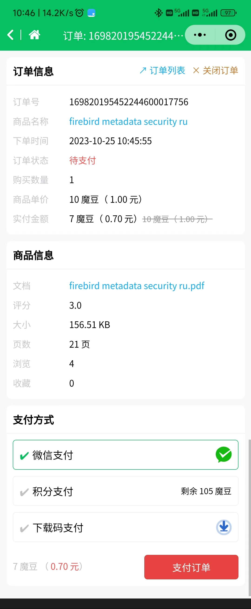

# moredoc-app

- `魔豆文库专业版`配套小程序，使用`uni-app`进行开发。
- 魔豆文库社区版暂未适配，请自行根据当前提供的小程序源码进行修改。
- APP 暂未适配。

## 二次开发

1. 下载最新的hbuilderx
2. 将 `config.example.js` 重命名为 `config.js`，并修改 `addr` 配置项
3. 执行 `npm install`，安装相关依赖
4. 修改`manifest.json`的微信小程序appid为您的微信小程序appid
5. 使用`hbuilderx`开发

### 程序发布

在 `HBuilderX` 中编译发布，发布后的文件在 `unpackage` 目录下，将 `unpackage` 目录下的打包上传到微信小程序后台即可。

### 后端配置

- 小程序首页轮播图：管理后台 -> 横幅管理 -> 新增，选择类型为`小程序横幅`，并填写相关信息

- 小程序配置：管理后台 -> 系统配置 -> 小程序配置

## 功能

- 文档筛选检索
- 微信支付
- 文档下载
- 文档搜索
- 文档阅读
- 文档评论
- 个人中心
    - 订单管理
    - VIP会员
    - 我的收藏
    - 资料、密码修改
- 用户登录注册
- 手机号码登录注册

## 页面预览

### 首页

 &nbsp;&nbsp;

### 资料库

 &nbsp;&nbsp;

### 个人中心

 &nbsp;&nbsp;

### 搜索

 &nbsp;&nbsp;

### 文档阅读

### 订单支付

## 开源协议

- Apache 2.0

> 无需征询授权，可免费使用。

## Author

- 企业：深圳市摩枫网络科技有限公司 
- Enterprise：Morefun Network Technology Co., Ltd 
- 官网：[https://mnt.ltd](https://mnt.ltd)

